# 机器学习
#### Author: kesth

- 数据集:(Data/)
    
    1. MNIST.mat [下载链接](http://www.cad.zju.edu.cn/home/dengcai/Data/MLData.html) 
             
            The MNIST database of 28x28 handwritten digits from Yann LeCun's page has a training set of 60,000 examples, and a test set of 10,000 examples.
            
            (the first 60k are the training images and the last 10k are the test images): contains variables 'fea' and 'gnd'. Each row of 'fea' is a sample; 'gnd' is the label.
       
    2. USPS.mat [下载链接](http://www.cad.zju.edu.cn/home/dengcai/Data/MLData.html) 
    
            The USPS handwritten digit database. We provide here a popular subset contains 9298 16x16 handwritten digit images in total, which is then split into 7291 training images and 2007 test images.
             contains variables 'fea' and 'gnd'. Each row of 'fea' is a sample; 'gnd' is the label.
            The first 7291 images are training images and the last 2007 images are test images.
                        
    3. COIL20.mat [下载链接](http://www.cad.zju.edu.cn/home/dengcai/Data/MLData.html) 
    
            It contains 20 objects. The images of each objects were taken 5 degrees apart as the object is rotated on a turntable and each object has 72 images. The size of each image is 32x 32 pixels, with 256 grey levels per pixel. Thus, each image is represented by a 1024-dimensional vector.
            contains variables 'fea' and 'gnd'. Each row of 'fea' is a sample; 'gnd' is the label.
         
    4. COIL100.mat [下载链接](http://www.cad.zju.edu.cn/home/dengcai/Data/MLData.html) 
    
            It contains 100 objects. The images of each objects were taken 5 degrees apart as the object is rotated on a turntable and each object has 72 images. The size of each image is 32x 32 pixels, with 256 grey levels per pixel. Thus, each image is represented by a 1024-dimensional vector. Sample images
    
            contains variables 'fea' and 'gnd'. Each row of 'fea' is a sample; 'gnd' is the label.
    5. iris.csv [下载链接](http://archive.ics.uci.edu/ml/datasets/iris) 
    
            This is perhaps the best known database to be found in the pattern recognition literature. Fisher's paper is a classic in the field and is referenced frequently to this day. (See Duda & Hart, for example.) 
            The data set contains 3 classes of 50 instances each, where each class refers to a type of iris plant. One class is linearly separable from the other 2; the latter are NOT linearly separable from each other

- 梯度下降算法:(Utils.optim.GD/SGD/mini_batch_SGD)
    
    1. 全批量梯度下降(Gradient Descent)
        
    2. 随机梯度下降(stochastic Gradient Descent)
    
    3. 小批量随机梯度下降(mini-batch stochastic Gradient Descent)

    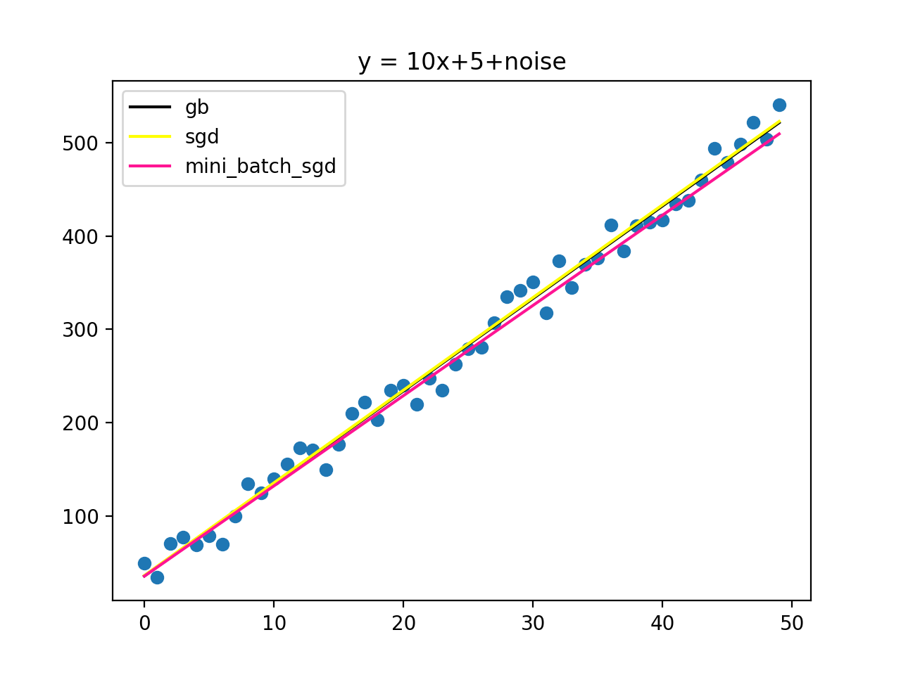
    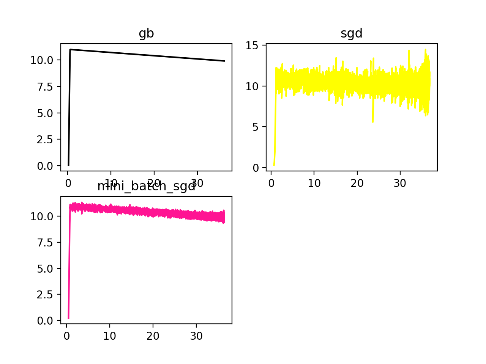
    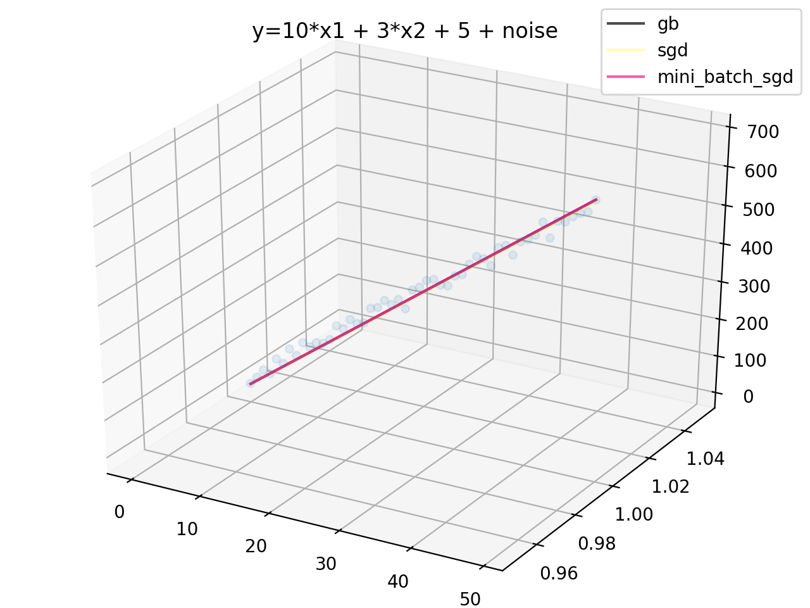
    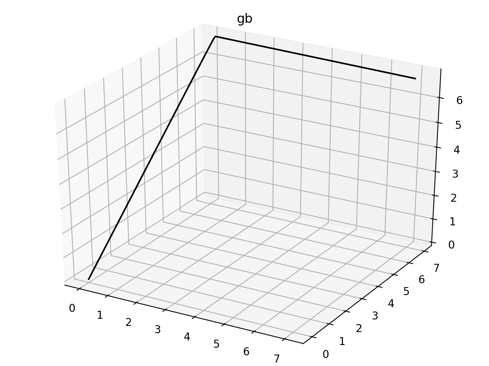
    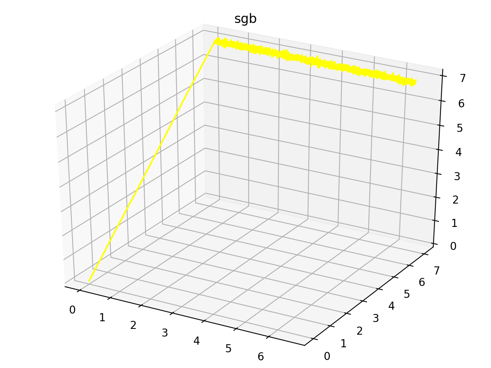
    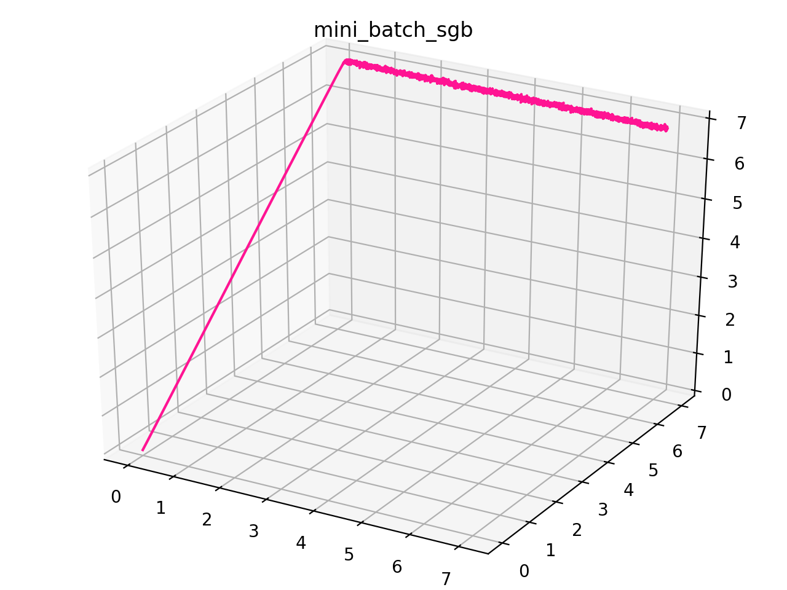
    
- 线性判别分析LDA(效果图是调用sklearn的lda,实现的lda见Utils.optim.LDA)
    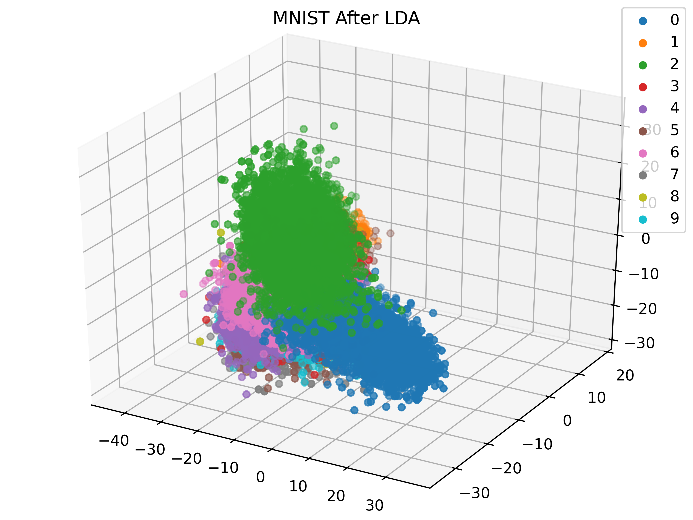
    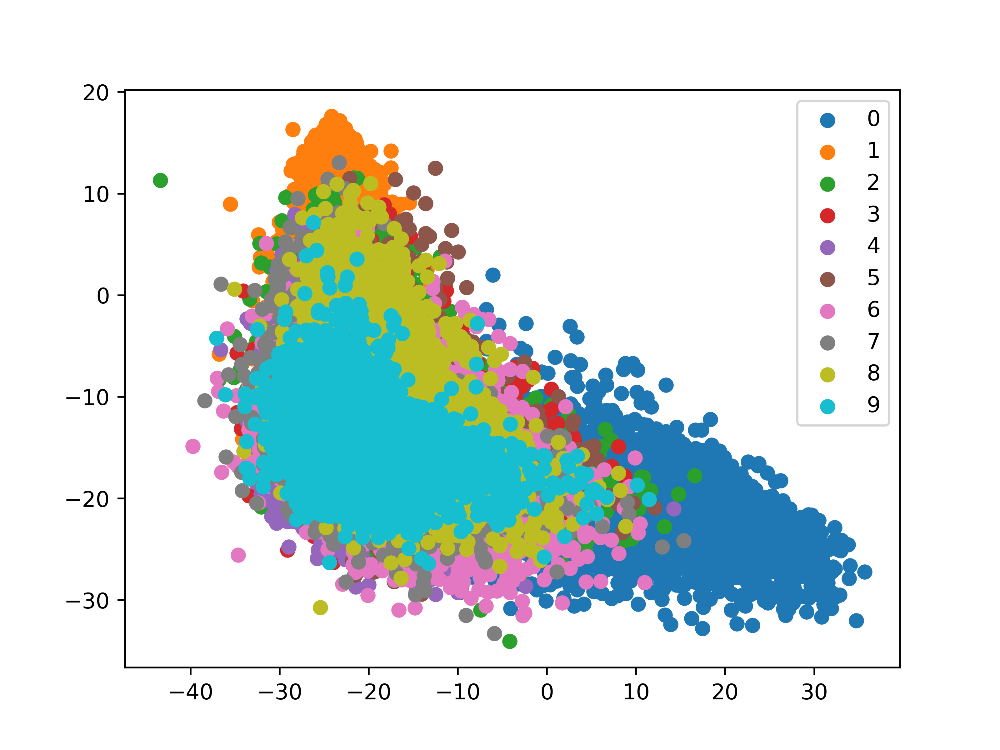
    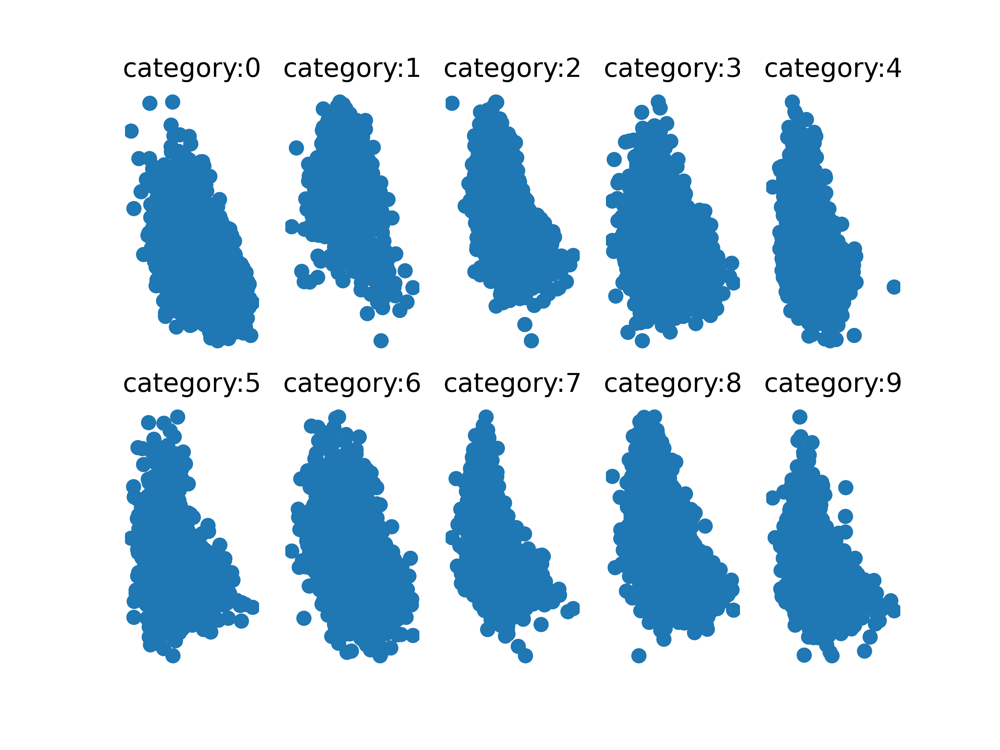
    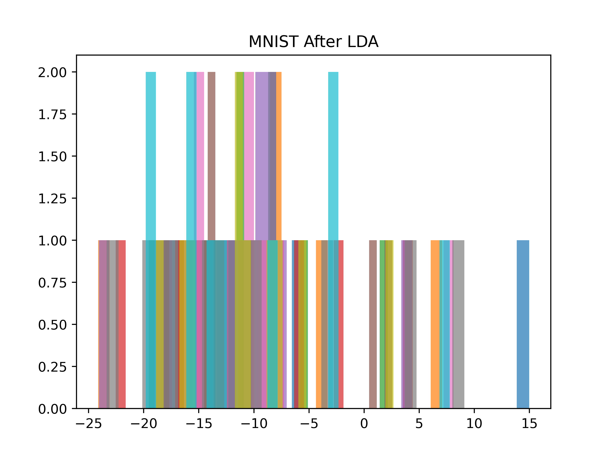
    
- [TODO:]决策树(Utils.optim.DecisionTree)
    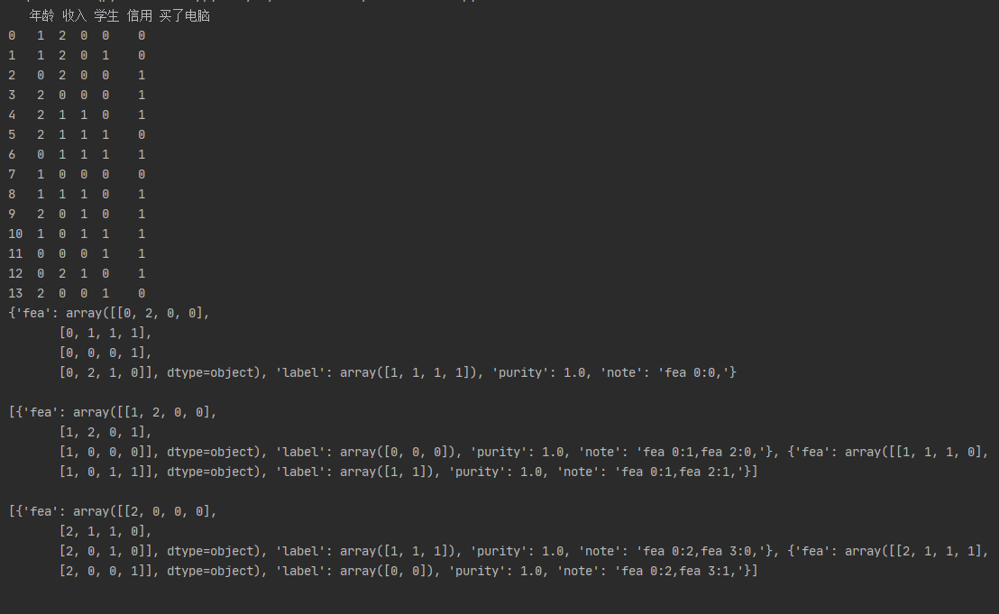

- 引用:

 1. http://www.cad.zju.edu.cn/home/dengcai/Data/MLData.html
 2. http://archive.ics.uci.edu/ml/datasets/iris